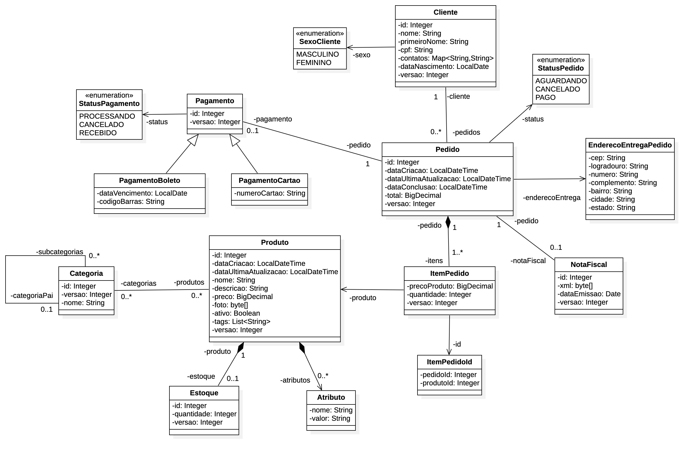
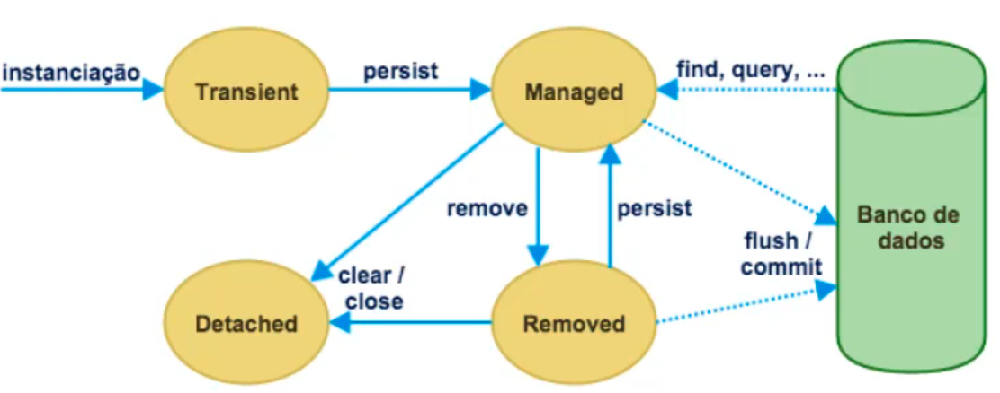

# Projeto de Estudos: JPA com Java e Spring

Este repositório contém um projeto desenvolvido com o objetivo de ensinar e demonstrar conceitos básicos da **Java Persistence API (JPA)** utilizando **Spring Boot**. É indicado para quem está começando a trabalhar com persistência de dados em aplicações Java.

## 🎯 Objetivos do Projeto

- Apresentar os principais conceitos da JPA
- Demonstrar como configurar e utilizar o Spring Data JPA
- Ensinar o mapeamento de entidades e relacionamentos (OneToOne, OneToMany, ManyToMany)
- Praticar operações básicas com banco de dados: CRUD
- Mostrar exemplos de queries com JPQL e métodos personalizados

## 🚀 Tecnologias Utilizadas

- Java 17+
- Spring Boot
- Spring Data JPA
- Maven
- Lombok 
- JUnit

## 🧩 Diagrama de Entidades



## 🏗️ Estrutura do Projeto

```
src/ 
├── main/ 
│ ├── java/ 
│ │ └── com.exemplo.jpa/ 
│ │ ├── model/ # Entidades JPA 
│ │ ├── repository/ # Interfaces que estendem JpaRepository 
│ │ ├── service/ # Regras de negócio 
│ │ └── controller/ # Endpoints REST 
│ └── resources/ 
│ ├── application.properties 
│ └── data.sql # Dados iniciais para testes 
└── test/ 
└── java/ # Testes unitários e de integração
```

## ⚙️ Como Executar

1. Clone o repositório:
```bash
  git clone https://github.com/AnaKlara/jpa-sandbox-ecommerce
```
Navegue até o diretório do projeto:

```bash
    cd jpa-sandbox-ecommerce
```

Execute o projeto:

Se estiver usando Maven:

```bash
    ./mvnw spring-boot:run
```

Ou rode pela sua IDE (IntelliJ, Eclipse, VS Code)

## 📚 Conceitos Demonstrados

- Anotações: @Entity, @Id, @GeneratedValue, @OneToMany, etc.
- Uso de JpaRepository para operações CRUD
- Query Methods (buscas personalizadas por nome, ID, etc.)
- Paginação e ordenação com Spring Data
- População automática do banco com data.sql

## 🧮 JPA




## 🔗 Links Úteis

https://docs.jboss.org/hibernate/orm/6.0/userguide/html_single/Hibernate_User_Guide.html#basic-bytearray


